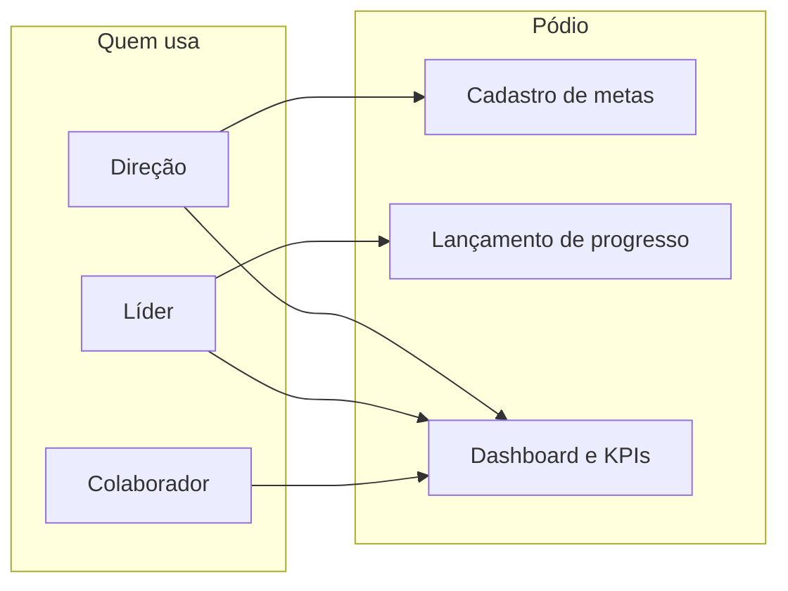

# Pódio Belluno

Sistema interno da [Belluno Tecnologia](https://github.com/belluno-company) para acompanhar metas e indicadores: a Direção cadastra o que precisa ser entregue, os líderes lançam o progresso do próprio setor e cada pessoa vê um dashboard no perímetro que lhe cabe.

> Produto em uso: [podio.belluno.com.br](https://podio.belluno.com.br)

## O que o sistema faz

- **Metas por competência** — cada indicador é um cadastro; alvo e realizado ficam no mês. A Direção replica o mês anterior para abrir a competência nova sem duplicar o cadastro.
- **Dashboard por perfil** — visão global (Direção), só o próprio setor (líder) ou só as metas em que a pessoa se enquadra (colaborador).
- **Lançamento de progresso** — líderes atualizam o realizado no perímetro do cargo de liderança do departamento.
- **Comissão de vendedor** — um cadastro com vários gatilhos (% e prêmio); no mês entram receita recorrente e adesão, e vale a maior faixa atingida.
- **Organização** — usuários, departamentos e cargos; inativar sem apagar histórico. Convite com senha temporária e troca no primeiro acesso.



## Stack

| Camada | Tecnologia |
| --- | --- |
| API | Laravel 13, PHP 8.4, Sanctum, PostgreSQL 16 |
| App | React 19, Vite, MUI 9, MUI X Charts |
| Auth | Cookies de sessão (SPA) + Policies no backend |
| Dev / prod | Docker Compose |

## Perfis

| Perfil | O que vê e o que faz |
| --- | --- |
| **Direção** | CRUD de usuários, departamentos (com cargos do setor) e metas (stepper de 3 etapas). |
| **Líder** | Cargo de liderança do departamento. Vê metas do próprio setor e as da empresa; lança progresso só nesse perímetro. |
| **Colaborador** | Feed das metas em que se enquadra (individual, cargo, departamento ou global). |

## Desenvolvimento local

O backend sobe no Docker; PHP na máquina não é obrigatório.

```bash
docker compose up -d --build
docker compose exec backend php artisan migrate --seed
cd frontend && npm install && npm run dev
```

- API: http://localhost:8000
- App: http://localhost:5173

O seed local cria usuários de demonstração (Direção, líderes e colaboradores). E-mails e senha estão em `backend/database/seeders/DatabaseSeeder.php` — só para desenvolvimento, não use isso em produção.

```bash
docker compose exec backend php artisan test
```

## Produção

Stack em `docker-compose.prod.yml`. Copie `.env.production.example` para `.env`, gere `APP_KEY` e credenciais fortes de banco, depois suba o compose. O seed de demonstração **não** roda em produção: o primeiro usuário da Direção é criado no servidor.

Uso interno da Belluno Tecnologia. Sem licença open source.
